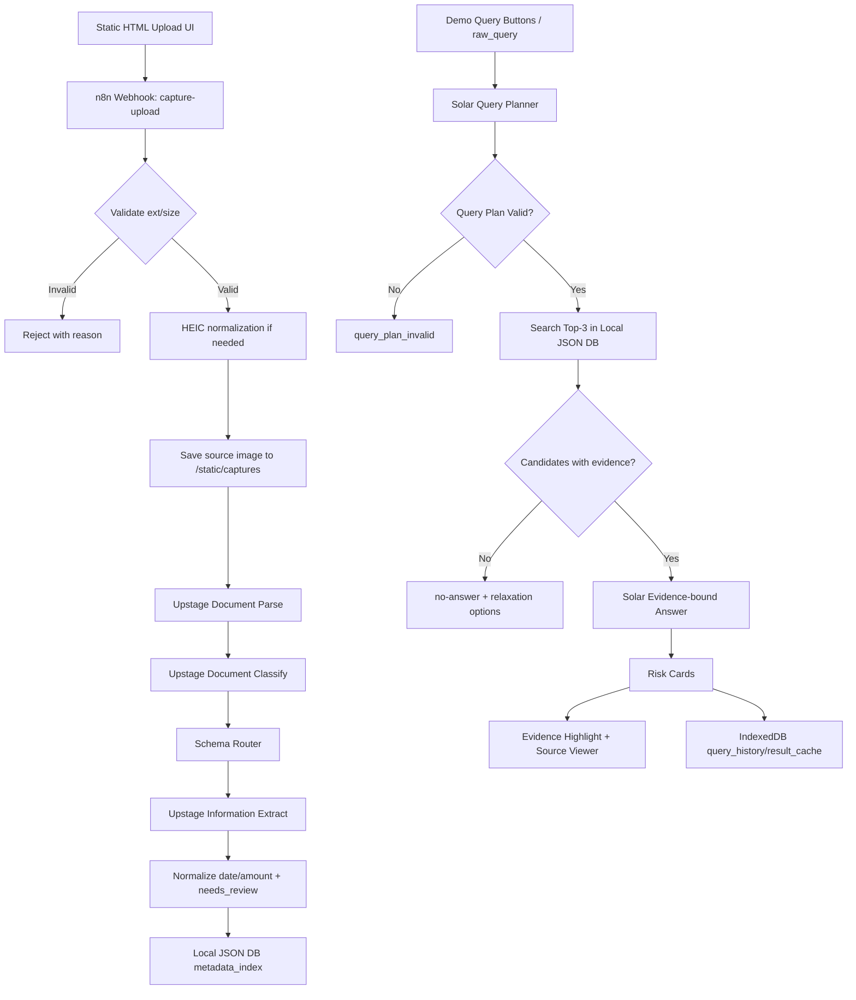

# 어디두지 PRD — v1.0 MVP

| 항목           | 내용                       |
| -------------- | -------------------------- |
| Document Owner | TBD PM / 기획              |
| Status         | Draft                      |
| Last Updated   | 2026-05-22                 |
| Target Release | 2026-05-22                 |
| Stakeholders   | Eng / Design / QA / BizOps |

## 0. TL;DR

어디두지는 대학생이 캡처해 둔 과제 공지, 영수증, 장학금, 학사·행정 공지를 다시 찾지 못해 발생하는 마감·금액·제출물 손실을 줄이는 학생용 캡처 정보 검색함이다. v1.0 MVP는 30장 고정 데모 데이터와 발표 중 1장 수동 업로드를 대상으로, 캡처 이미지를 Upstage Document Parse → Document Classify → Information Extract → Solar LLM 기반 질의/답변 흐름으로 구조화한다. 핵심 출력은 원본 캡처, 근거 문장, deadline/amount/required_submission/institution/action_items가 포함된 손실 위험 카드다. 성공 기준은 3개 대표 데모 질문 3/3 성공, Top-3 정답 포함률 90% 이상, 근거 없는 필드 환각 답변률 0%, no-answer 정확도 100%이다.

## 1. Background & Problem Statement

### 1.1 시장/사용자 문제

대학생은 학사 공지, 과제 안내, 장학금 신청 안내, 결제 영수증, 행사 안내를 메모보다 캡처로 저장하는 경우가 많다. 그러나 실제 문제는 저장이 아니라 회수다. 필요한 순간에 사용자는 “어디에 저장했는지”보다 “이번 주 마감이 무엇인지”, “정산해야 할 2만 원 이상 영수증이 무엇인지”, “장학금 신청 기간과 제출물이 무엇인지”를 찾고자 한다.

기획서의 핵심 문제 정의는 다음과 같다.

| Problem Area | 사용자 손실                                        | 제품이 회수해야 하는 정보                                             | 관련 출처                                  |
| ------------ | -------------------------------------------------- | --------------------------------------------------------------------- | ------------------------------------------ |
| 과제 마감    | LMS/강의 공지를 캡처했지만 제출 기한·제출물을 잊음 | course, deadline, required_submission, action_items, evidence_text    | 기획서 §1, §2.3, §2.4 / SRS §1.1           |
| 영수증 정산  | 팀·동아리 정산에서 캡처 영수증이 누락됨            | amount, merchant, payment_date, source_image_path, evidence_text      | 기획서 §2.3, §2.4 / SRS FR-011, FR-019     |
| 장학금 신청  | 신청 기간·기관·제출 서류를 놓침                    | date_range, deadline, institution, required_submission, evidence_text | 기획서 §2.3, §2.4 / SRS FR-010, FR-014~018 |
| 행정 공지    | 기숙사·학과·행정 신청 마감을 놓침                  | deadline, institution, action_items, evidence_text                    | 기획서 §2.3 / SRS FR-007~009               |

### 1.2 현재 솔루션의 한계

기존 사진첩 검색은 날짜, 장소, 이미지 유사도 중심이며 “이번 주 내가 놓치면 손해 보는 일”을 문서 필드 단위로 답하지 못한다. 일반 OCR 도구는 텍스트 덩어리를 반환하지만, 사용자가 다시 마감·금액·제출물을 해석해야 한다. 자유형 챗봇은 근거 없는 필드까지 생성할 수 있으므로, 학생의 실제 손실 방지 시나리오에서는 환각 답변이 치명적이다.

따라서 v1.0은 범용 사진 관리가 아니라 다음 3가지 문제에만 집중한다.

1. 캡처 이미지를 문서형 데이터로 구조화한다.
2. 마감·금액·제출물·기관명·해야 할 일을 필드로 회수한다.
3. 근거 문장이 없으면 답하지 않고 no-answer로 처리한다.

### 1.3 기회 (Why Now)

Upstage Document Parse, Document Classify, Information Extract, Solar LLM을 단계별로 사용하면 캡처를 단순 OCR 텍스트가 아니라 `doc_type → extract_schema_id → extracted_fields → evidence-bound answer` 구조로 처리할 수 있다. 해커톤 MVP에서는 30장 golden dataset과 3개 대표 질문으로 범위를 제한해 데모 안정성과 정량 검증 가능성을 높인다.

**Input Reconciliation Summary**

| 구분                 | 정합성/충돌/공백 | 결정                                                                                                        | 근거                                                                                  |
| -------------------- | ---------------- | ----------------------------------------------------------------------------------------------------------- | ------------------------------------------------------------------------------------- |
| 비즈니스 목표 vs SRS | 정합             | 양 문서 모두 “학생용 캡처 정보 검색함”과 손실 방지 카드에 초점                                              | 기획서 §1~2 / SRS §1.1~1.2                                                            |
| 데모 범위            | 정합             | 30장 사전 인덱싱 + 1장 라이브 업로드 + 3개 데모 질문 고정                                                   | 기획서 §2.1, §3.6~3.7 / SRS FR-022, FR-033                                            |
| AI 파이프라인        | 정합             | Upstage-first 파이프라인 유지                                                                               | 기획서 §3.2~3.3 / SRS IR-EXT-001~007                                                  |
| Frontend 기술        | 충돌             | 기획서의 React/Next.js 후보보다 SRS v1.1과 선택 컨텍스트를 우선하여 HTML/CSS/Vanilla JS + Tailwind CSS 채택 | 비즈니스 목표는 UI 프레임워크에 독립적이며 SRS v1.1이 최신 기술 결정. SRS CON-011~012 |
| Backend 기술         | 충돌             | 별도 Backend 서버 제거, n8n Webhook/workflow가 파일 검증·Upstage 호출·Local JSON DB 저장 담당               | 비즈니스 목표 충족에 별도 Backend가 필수 아님. SRS CON-013~014, IR-N8N-001~006        |
| 저장소               | 충돌             | SQLite 후보 제거, Local JSON DB를 source of truth로 사용하고 IndexedDB는 클라이언트 캐시로 제한             | SRS v1.1 기술 결정과 선택 컨텍스트 우선. SRS CON-015~017, DR-RULE-009                 |
| 자동 입력 채널       | 충돌/범위 제외   | 메신저 channel adapter는 MVP와 확장 계획에서 제외, 브라우저 알림은 Future 계획으로만 유지                   | SRS CON-018, FR-032                                                                   |
| 접근성 기준          | 공백             | MVP 가정으로 핵심 클릭 액션 키보드 접근 가능 100%를 NFR에 추가하고 세부 기준은 Open Question으로 관리       | SRS에 명시 없음. PRD OQ-006                                                           |
| HEIC 정규화 방식     | 공백             | 기능 요구는 유지하되 구현 방식은 n8n 노드 또는 외부 CLI 중 결정 필요                                        | SRS OI-009                                                                            |

## 2. Goals & Non-Goals

### 2.1 Product Goals (비즈니스 관점)

| Goal ID | Product Goal                                                    | Why                                                       | Success Metric                               | Traceability                                           |
| ------- | --------------------------------------------------------------- | --------------------------------------------------------- | -------------------------------------------- | ------------------------------------------------------ |
| PG-001  | 3개 손실 방지 시나리오를 데모에서 끝까지 성공시킨다.            | 해커톤 MVP의 사용자 가치와 평가 방어를 명확히 하기 위함   | 대표 데모 질문 성공률 3/3                    | 기획서 §2.4, §4 / SRS NFR-QLT-001, FR-022              |
| PG-002  | 캡처를 원본+근거+필드 카드로 회수한다.                          | “저장 위치”가 아닌 “손실 가능 정보”를 반환하기 위함       | 근거 문장 표시율 ≥95%, 결과 카드 표시율 100% | 기획서 §2.1~2.2 / SRS FR-019~021, NFR-QLT-006          |
| PG-003  | 근거 없는 답변과 LLM 환각을 제품 구조에서 차단한다.             | 학생의 마감·금액·제출물 오답은 실제 손실로 이어질 수 있음 | 환각 답변률 0%, no-answer 정확도 100%        | 기획서 §2.5, §4 / SRS FR-017~018, NFR-QLT-007~008      |
| PG-004  | Upstage-first workflow를 n8n으로 시각화 가능한 구조로 제출한다. | 기술 완성도와 Low-code 평가 매핑 확보                     | n8n workflow 주요 노드 매핑 100%             | 기획서 §3.3, §3.9 / SRS IR-N8N-001~006, IR-EXT-001~007 |
| PG-005  | 30장 golden dataset으로 정량 QA 리포트를 생성한다.              | 감성적 주장 대신 측정 가능한 품질 기준으로 방어           | test_report.json 필수 지표 9개 포함          | 기획서 §3.7, §4 / SRS FR-031, FR-033                   |

**Why → What → How Linkage**

| Why                                       | What                                       | How                                                             | 검증                           |
| ----------------------------------------- | ------------------------------------------ | --------------------------------------------------------------- | ------------------------------ |
| 캡처 회수 실패로 인한 과제·정산·신청 손실 | 3개 데모 질문 버튼과 자연어 질의 처리      | Solar Query Planner → query_plan validation → Top-3 검색        | NFR-QLT-001, NFR-QLT-002       |
| 단순 OCR이 사용자 재해석을 요구           | 문서 분류·스키마 라우팅·필드 추출          | Document Parse → Classify → Schema Router → Information Extract | FR-006~FR-009, NFR-QLT-003~006 |
| 생성형 답변 환각 위험                     | evidence-bound answer와 no-answer 정책     | `allow_free_generation=false`, `require_evidence_text=true`     | FR-017~018, NFR-QLT-007~008    |
| 라이브 데모 실패 리스크                   | 사전 인덱싱, 캐시 fallback, 백업 가능 구조 | Local JSON DB, cache_entries, n8n 처리 로그                     | FR-024, NFR-AVL-002~003        |

### 2.2 User Goals (사용자 관점)

| User Goal ID | User Goal                                                      | 측정 가능 기준                                                             | Traceability                    |
| ------------ | -------------------------------------------------------------- | -------------------------------------------------------------------------- | ------------------------------- |
| UG-001       | 이번 주 마감 과제 공지를 3개 이하 결과 카드에서 찾는다.        | `assignment` Top-3 안에 정답 포함, deadline 오름차순 정렬                  | FR-014~016, FR-022, NFR-QLT-002 |
| UG-002       | 2만 원 넘는 영수증을 금액 기준으로 찾고 원본을 확인한다.       | `amount_min=20000`, KRW 정규화 성공, 원본 뷰어 2초 이내 표시               | FR-011, FR-014~017, FR-021      |
| UG-003       | 장학금 신청 기간과 필요 제출물을 근거 문장으로 확인한다.       | date_range/deadline, institution, required_submission에 evidence_text 존재 | FR-010, FR-014~018, FR-020      |
| UG-004       | 확실하지 않은 캡처를 숨기지 않고 확인 필요 상태로 본다.        | 낮은 confidence/추출 충돌 샘플 표시율 100%                                 | FR-012, NFR-QLT-009             |
| UG-005       | 답이 없을 때 허위 답변 대신 조건 완화 또는 원본 확인을 받는다. | no-answer 시 relaxation_options 1~3개 표시                                 | FR-018, FR-025, NFR-USA-004     |

### 2.3 Non-Goals (이번 릴리즈에서 다루지 않는 것 — 명시적 선언)

| Non-Goal ID | Non-Goal                                  | 제외 근거                                        | 후속 처리                                                 |
| ----------- | ----------------------------------------- | ------------------------------------------------ | --------------------------------------------------------- |
| NG-001      | 사진첩 자동 동기화                        | MVP는 30장 고정 데이터와 1장 수동 업로드에 집중  | Future Backlog 검토 대상 아님. SRS CON-003                |
| NG-002      | 캘린더 실연동                             | 해커톤 데모 안정성과 no-answer 정책이 우선       | Future Backlog 검토 대상 아님. SRS CON-004                |
| NG-003      | 자유형 챗봇                               | 근거 없는 답변과 환각을 차단해야 함              | `Evidence-bound Answer`만 허용. SRS CON-005~006           |
| NG-004      | 별도 Backend 서버                         | 선택 컨텍스트와 SRS v1.1에서 Backend 제거        | n8n workflow가 처리 담당. SRS CON-013~014                 |
| NG-005      | 수천 장 이상 장기 인덱싱                  | MVP는 30장 golden dataset 품질 검증이 목적       | 확장성 NFR에서 300개 dry-run만 Future로 관리              |
| NG-006      | 메신저 channel adapter                    | v1.1에서 MVP 및 확장 계획 모두 제외              | 브라우저 알림 계획만 Future에 유지. SRS CON-018           |
| NG-007      | 실제 브라우저 예약 알림 구현              | MVP에서는 `notification_plan.json` 문서화만 정의 | Future Backlog. SRS CON-021, FR-032                       |
| NG-008      | threshold sweep 결과 산출                 | v1.1에서 MVP 보류                                | `test_report.json.deferred_items`에 기록. SRS NFR-QLT-010 |
| NG-009      | golden dataset 내 모호분류 전용 샘플 구성 | v1.1에서 MVP 보류                                | synthetic ambiguous UI 테스트로만 보조. SRS NFR-QLT-011   |

## 3. Target Users & Personas

| Persona                    | 특성                                                | Pain Point                                 | Job-to-be-Done                                                      |
| -------------------------- | --------------------------------------------------- | ------------------------------------------ | ------------------------------------------------------------------- |
| P-001 대학생               | LMS, 에브리타임, 학과 공지, 메신저 캡처를 자주 저장 | 과제 제출 마감과 제출물을 기억하지 못함    | “이번 주 제출해야 할 과제를 D-day와 제출물 기준으로 보고 싶다.”     |
| P-002 장학금 신청자        | 장학금 공지와 제출 서류 캡처를 보관                 | 신청 기간, 기관, 필요 서류를 놓침          | “장학금 신청 기간과 제출물을 근거 문장으로 확인하고 싶다.”          |
| P-003 동아리·프로젝트 팀원 | 회식·구매·교통 영수증을 캡처로 저장                 | 2만 원 이상 정산 항목이 누락됨             | “금액 기준으로 영수증을 찾고 원본 캡처를 열고 싶다.”                |
| P-004 행정 공지 이용자     | 기숙사, 학과, 학생처 공지 캡처를 저장               | 신청 마감, 담당 기관, 행동 항목을 놓침     | “행정 공지에서 해야 할 일과 마감을 카드로 보고 싶다.”               |
| P-005 발표·실습 팀         | 여러 앱에 장소·결제·공지 캡처가 분산                | 위치보다 마감·금액·제출물 기준 검색이 필요 | “데모 질문 버튼으로 구조화된 검색 결과를 안정적으로 시연하고 싶다.” |

## 4. Success Metrics

### 4.1 North Star Metric

**NSM-001: Evidence-backed Loss Information Retrieval Rate**

정의: 30장 golden dataset의 대표 질의에서 정답 캡처가 Top-3 안에 포함되고, 사용자에게 표시된 핵심 필드가 `evidence_text`를 가지며, 근거 없는 필드 환각이 발생하지 않은 질의의 비율.

| Metric                                          | 정의                                                                                 | 목표값                          | 측정 주기                         | 측정 도구                                              |
| ----------------------------------------------- | ------------------------------------------------------------------------------------ | ------------------------------- | --------------------------------- | ------------------------------------------------------ |
| Evidence-backed Loss Information Retrieval Rate | `(Top-3 정답 포함 ∧ 핵심 필드 evidence_text 존재 ∧ 환각 답변 없음) / 30개 대표 질의` | ≥90%; 대표 데모 질문은 3/3 성공 | 개발 중 매 빌드 / 릴리즈 직전 1회 | `/data/test_report.json`, n8n query log, Local JSON DB |

### 4.2 Input Metrics (선행 지표)

| Metric                                  | 정의                                                                   | 목표값                                                      | 측정 주기                    | 측정 도구                                                               |
| --------------------------------------- | ---------------------------------------------------------------------- | ----------------------------------------------------------- | ---------------------------- | ----------------------------------------------------------------------- |
| Golden Dataset Indexing Completion      | 30장 데모 캡처 중 `indexed_count`가 완료된 비율                        | 100%                                                        | 릴리즈 전 1회, 리허설 전 1회 | `/data/golden_dataset.json`, `/data/metadata_index.json`, FR-033 테스트 |
| Query Plan Validity Rate                | Solar Query Planner 출력이 허용 JSON Schema를 통과한 비율              | 100% for 3 demo queries; ≥95% for 30 representative queries | 매 빌드                      | n8n `/webhook/query` contract test, FR-015                              |
| Top-3 Correct Inclusion Rate            | 대표 질의별 정답 캡처가 상위 3개 후보 안에 포함된 비율                 | ≥90%                                                        | 매 빌드                      | `/data/test_report.json`, FR-016                                        |
| Deadline/Date Extraction Accuracy       | 과제·공지·장학금의 deadline/date_range가 정답 메타데이터와 일치한 비율 | ≥90%                                                        | 매 빌드                      | QA 비교 스크립트, NFR-QLT-003                                           |
| Amount Extraction Accuracy              | 영수증 6장의 normalized_amount가 정답과 일치한 비율                    | ≥95%                                                        | 매 빌드                      | QA 비교 스크립트, NFR-QLT-004                                           |
| Required Submission Extraction Accuracy | 과제·장학금의 required_submission이 정답과 일치한 비율                 | ≥85%                                                        | 매 빌드                      | QA 비교 스크립트, NFR-QLT-005                                           |
| Evidence Display Rate                   | 결과 카드의 핵심 필드에 evidence_text가 표시된 비율                    | ≥95%                                                        | 매 빌드                      | UI E2E test, NFR-QLT-006                                                |
| Manual Upload Handoff Latency           | HTML 업로드 후 `upload_job_id` 화면 표시까지 걸린 시간                 | P95 ≤1.0초                                                  | 라이브 업로드 리허설 5회     | Browser Performance API, n8n Webhook log, FR-001                        |
| Result Card First Render Latency        | 질의 응답 후 첫 결과 카드 렌더링까지 걸린 시간                         | P95 ≤2.0초                                                  | 매 빌드                      | Browser Performance API, NFR-PER-002                                    |
| Client Query Restore Rate               | 새로고침 후 최근 질의 5건 복원 성공률                                  | 100%                                                        | 매 빌드                      | IndexedDB inspection, FR-034                                            |

### 4.3 Guardrail Metrics (악화 방지 지표)

| Metric                        | 정의                                                                 | 목표값                                  | 측정 주기            | 측정 도구                                             |
| ----------------------------- | -------------------------------------------------------------------- | --------------------------------------- | -------------------- | ----------------------------------------------------- |
| Hallucinated Field Rate       | evidence_text가 없는 필드를 답변에 포함한 비율                       | 0%                                      | 매 빌드 / 릴리즈 전  | unsupported field 질의 테스트, NFR-QLT-008            |
| No-answer Accuracy            | 관련 없는 질문 5개에서 허위 답변 없이 no-answer를 반환한 비율        | 100%                                    | 매 빌드              | no-answer test set, FR-018                            |
| Needs Review Visibility       | 낮은 confidence 또는 추출 충돌 카드가 UI에 숨겨지지 않고 표시된 비율 | 100% for 2 low-confidence/noise samples | 매 빌드              | UI E2E test, FR-012                                   |
| API Key Exposure              | Frontend HTML/CSS/JS/IndexedDB에 Upstage API Key가 노출된 건수       | 0건                                     | 배포 전 1회          | static grep, DevTools storage inspection, NFR-SEC-001 |
| PII Exposure in Demo Dataset  | 이름·학번·결제정보 원문 미마스킹 노출 건수                           | 0건                                     | 데이터셋 확정 전 1회 | golden_dataset 검수, NFR-COMP-001                     |
| Cache Fallback Success        | API 실패 시 동일 이미지 해시 캐시가 반환되는 비율                    | 100% for pre-indexed 30 captures        | 리허설 전 1회        | API mock failure test, FR-024                         |
| Local JSON DB Backup Creation | `metadata_index.json` 업데이트 전 백업 파일 생성률                   | 100%                                    | JSON write test마다  | filesystem inspection, NFR-AVL-004                    |
| Unsupported File Block Rate   | 허용되지 않은 파일 확장자/MIME 업로드 차단 비율                      | 100% for 10 negative cases              | 매 빌드              | upload negative test, FR-002~003                      |

## 5. User Stories & Use Cases

### US-001: 캡처 1장 수동 업로드

- **As a** 대학생, **I want to** JPG/PNG/HEIC 캡처 1장을 웹 화면에서 업로드하고 처리 상태를 받기, **so that** 사진첩을 뒤지지 않고 검색 가능한 캡처로 등록할 수 있다.
- **Priority**: P0
- **Acceptance Criteria** (Given-When-Then):
  - Given 사용자가 HTML 업로드 폼에서 JPG/PNG/HEIC 이미지 1장을 선택하고 파일 크기가 10MB 이하인 상태
  - When 사용자가 업로드 버튼을 클릭한다
  - Then Frontend는 별도 Backend 없이 n8n `/webhook/capture-upload`로 `multipart/form-data.image`를 전송하고 1초 이내 `upload_job_id`, `capture_id`, `status=received`를 화면에 표시한다
  - Given 사용자가 `.pdf` 또는 10MB 초과 파일을 업로드한다
  - When validation이 실행된다
  - Then 시스템은 `status=rejected`와 `reject_reason`을 반환하고 Upstage API를 호출하지 않는다
  - Given 사용자가 HEIC 파일을 업로드한다
  - When 정규화가 성공한다
  - Then 시스템은 JPG 변환 경로와 원본 파일 해시를 저장한다
- **연관 요구사항**: FR-001, FR-002, FR-003, FR-004, FR-005, IR-UI-001~003, IR-N8N-001, NFR-USA-001, NFR-CMP-001, NFR-SEC-001
- **출처**: 기획서 §2.2, §3.3 / SRS §3 FR-001~005, §6 IR-UI/IR-N8N

### US-002: 30장 golden dataset 사전 인덱싱

- **As a** QA/발표 담당자, **I want to** 30장 데모 캡처를 일괄 인덱싱하기, **so that** 라이브 API 지연 없이 3개 대표 질문을 안정적으로 시연할 수 있다.
- **Priority**: P0
- **Acceptance Criteria** (Given-When-Then):
  - Given `/data/golden_dataset.json`과 `/static/captures/*`에 30장 캡처가 준비된 상태
  - When 일괄 인덱싱 workflow가 실행된다
  - Then 시스템은 30개 `capture_record`와 `indexing_summary.indexed_count=30`을 생성한다
  - Given 동일 이미지 해시가 이미 존재한다
  - When 인덱싱을 재요청한다
  - Then 시스템은 신규 record를 생성하지 않고 기존 `capture_id`를 반환한다
  - Given Upstage API가 실패하고 동일 이미지 해시의 cache가 존재한다
  - When fallback 로직이 실행된다
  - Then 시스템은 cached result와 `cache_hit=true`를 반환한다
- **연관 요구사항**: FR-006~013, FR-024, FR-033, DR-001~012, NFR-AVL-002~004, NFR-PER-004
- **출처**: 기획서 §3.6~3.7, §5.1 / SRS §3 FR-006~013, FR-024, FR-033

### US-003: 캡처를 문서형 데이터와 손실 위험 카드로 구조화

- **As a** 대학생, **I want to** 캡처에서 마감·금액·제출물·기관명을 구조화된 카드로 보기, **so that** 캡처 원문을 다시 해석하지 않고 해야 할 일을 결정할 수 있다.
- **Priority**: P0
- **Acceptance Criteria** (Given-When-Then):
  - Given 저장된 캡처 이미지가 있다
  - When Document Parse, Document Classify, Schema Router, Information Extract가 순서대로 실행된다
  - Then 시스템은 `parsed_markdown`, `layout_blocks`, `doc_type`, `extract_schema_id`, 핵심 추출 필드, `evidence_text`, confidence를 저장한다
  - Given 추출된 날짜 또는 금액 필드가 있다
  - When 정규화가 실행된다
  - Then 날짜는 KST ISO-8601 형식, 금액은 KRW 정수로 저장된다
  - Given parse/classify/extract confidence 중 하나가 0.70 미만이거나 금액/날짜 충돌이 있다
  - When 결과 카드가 렌더링된다
  - Then `needs_review=true`와 confidence badge가 표시되고 결과는 숨겨지지 않는다
  - Given 결과 카드가 있다
  - When 사용자가 원본 보기와 근거 문장 영역을 확인한다
  - Then 원본 캡처는 2초 이내 표시되고 `evidence_text`는 원문 영역에서 하이라이트된다
- **연관 요구사항**: FR-006, FR-007, FR-008, FR-009, FR-010, FR-011, FR-012, FR-013, FR-019, FR-020, FR-021, NFR-QLT-003~006, NFR-QLT-009, NFR-USA-002
- **출처**: 기획서 §2.2, §3.2~3.4, §4 / SRS §3 FR-006~013, FR-019~021

### US-004: “이번 주 마감 과제 공지” 검색

- **As a** 대학생, **I want to** 이번 주 마감 과제 공지를 버튼으로 검색하기, **so that** 놓치면 감점되는 제출물을 먼저 처리할 수 있다.
- **Priority**: P0
- **Acceptance Criteria** (Given-When-Then):
  - Given 사용자가 `이번 주 마감 과제 공지` 데모 버튼을 클릭한다
  - When Solar Query Planner가 실행된다
  - Then query_plan은 `target_doc_type=assignment`, `filters.deadline_range=this_week`, `sort_rule=deadline_asc`, `answer_policy.mode=evidence_bound`를 포함한다
  - Given 유효한 query_plan이 있다
  - When Local JSON DB 검색이 실행된다
  - Then 시스템은 deadline 오름차순 후보를 최대 3개 반환한다
  - Given 후보 카드에 required_submission과 evidence_text가 있다
  - When Evidence-bound Answer가 실행된다
  - Then 답변은 과목명, D-day/deadline, 제출물, 원본 캡처 링크, 근거 문장을 표시한다
- **연관 요구사항**: FR-014, FR-015, FR-016, FR-017, FR-018, FR-022, NFR-QLT-001, NFR-QLT-002, NFR-QLT-003, NFR-QLT-006, NFR-QLT-008
- **출처**: 기획서 §2.4, §3.5 / SRS §3 FR-014~018, FR-022

### US-005: “2만 원 넘는 영수증” 검색

- **As a** 동아리·프로젝트 팀원, **I want to** 2만 원 이상 영수증을 금액 기준으로 찾기, **so that** 정산 누락을 줄일 수 있다.
- **Priority**: P0
- **Acceptance Criteria** (Given-When-Then):
  - Given 사용자가 `2만 원 넘는 영수증` 데모 버튼을 클릭한다
  - When Query Planner가 실행된다
  - Then query_plan은 `target_doc_type=receipt`, `filters.amount_min=20000`을 포함한다
  - Given 영수증 후보의 evidence_text에 `23,500원`이 있다
  - When 금액 정규화가 실행된다
  - Then 시스템은 `normalized_amount=23500`, `currency=KRW`를 저장한다
  - Given amount, merchant, payment_date가 evidence_text와 함께 존재한다
  - When 결과 카드가 표시된다
  - Then 시스템은 금액, 상호명, 결제일, evidence_text, 원본 캡처 링크를 표시한다
- **연관 요구사항**: FR-011, FR-014, FR-015, FR-016, FR-017, FR-018, FR-019, FR-021, FR-022, NFR-QLT-001, NFR-QLT-004, NFR-QLT-006, NFR-QLT-008
- **출처**: 기획서 §2.4, §3.4~3.5 / SRS §3 FR-011, FR-014~019, FR-021~022

### US-006: “장학금 신청 기간” 검색

- **As a** 장학금 신청자, **I want to** 장학금 신청 기간과 제출 서류를 근거 문장으로 확인하기, **so that** 기간 또는 제출물 누락으로 신청 기회를 잃지 않을 수 있다.
- **Priority**: P0
- **Acceptance Criteria** (Given-When-Then):
  - Given 사용자가 `장학금 신청 기간` 데모 버튼을 클릭한다
  - When Query Planner가 실행된다
  - Then query_plan은 `target_doc_type=scholarship`, `query_intent=find_application_period`를 포함한다
  - Given 후보 카드에 date_range 또는 deadline, institution, required_submission이 있다
  - When Evidence-bound Answer가 실행된다
  - Then 시스템은 신청 기간, 기관명, 필요 서류, evidence_text를 표시한다
  - Given required_submission의 evidence_text가 없다
  - When 답변 생성이 실행된다
  - Then 해당 필드는 추론으로 보완하지 않고 no-answer 또는 부분 답변으로 처리된다
- **연관 요구사항**: FR-010, FR-014, FR-015, FR-016, FR-017, FR-018, FR-019, FR-020, FR-022, NFR-QLT-001, NFR-QLT-003, NFR-QLT-005, NFR-QLT-006, NFR-QLT-008
- **출처**: 기획서 §2.4, §4 / SRS §3 FR-010, FR-014~020, FR-022

### US-007: 근거 없는 질문의 no-answer와 조건 완화

- **As a** 사용자, **I want to** 근거가 없을 때 허위 답변 대신 조건 완화 옵션을 받기, **so that** 잘못된 정보로 행동하지 않을 수 있다.
- **Priority**: P0
- **Acceptance Criteria** (Given-When-Then):
  - Given 사용자가 요청한 필드에 evidence_text가 없다
  - When Evidence-bound Answer가 실행된다
  - Then 시스템은 `no_answer=true`, `no_answer_reason=missing_evidence_text`를 반환한다
  - Given `no_candidate=true` 또는 no-answer가 발생한다
  - When no-answer UI가 렌더링된다
  - Then 시스템은 `date_range_expand_7d`, `search_all_doc_type`, `include_needs_review` 중 최소 1개, 최대 3개의 조건 완화 옵션을 표시한다
- **연관 요구사항**: FR-018, FR-025, IR-UI-008, NFR-QLT-007, NFR-QLT-008, NFR-USA-004
- **출처**: 기획서 §2.1, §5.1~5.2 / SRS §3 FR-018, FR-025

### US-008: 최근 질의와 UI 상태 클라이언트 캐시

- **As a** 사용자, **I want to** 새로고침 후에도 최근 질의와 결과 상태가 복원되기, **so that** 데모 중 UI 상태 손실을 줄일 수 있다.
- **Priority**: P0
- **Acceptance Criteria** (Given-When-Then):
  - Given 사용자가 데모 질문을 1회 실행했다
  - When 결과가 화면에 표시된다
  - Then IndexedDB `odiduji_client_store.query_history`에 `raw_query`, `query_id`, `created_at`이 저장된다
  - Given 사용자가 페이지를 새로고침한다
  - When UI 초기화가 실행된다
  - Then 최근 질의 5건이 0.5초 P95 이내 복원된다
  - Given IndexedDB 저장이 실행된다
  - When DevTools storage inspection을 수행한다
  - Then Upstage API Key와 원본 개인정보 원문은 저장되어 있지 않다
- **연관 요구사항**: FR-034, IR-UI-004, NFR-PER-005, NFR-USA-005, NFR-SEC-005, DR-011
- **출처**: SRS §3 FR-034, §4 NFR-PER/USA/SEC, §5 DR-011

### US-009: QA 리포트 생성

- **As a** QA 담당자, **I want to** golden dataset 테스트 결과를 `/data/test_report.json`으로 생성하기, **so that** MVP 품질을 정량적으로 방어할 수 있다.
- **Priority**: P0
- **Acceptance Criteria** (Given-When-Then):
  - Given 30장 golden dataset과 대표 질의가 준비되어 있다
  - When QA 테스트를 실행한다
  - Then `/data/test_report.json`은 9개 필수 지표를 포함한다: 대표 데모 질문 성공률, Top-3 정답 포함률, 마감·기간 추출 정확도, 금액 추출 정확도, 제출물 추출 정확도, 근거 문장 표시율, no-answer 정확도, 환각 답변률, 확인 필요 UI 동작률
  - Given threshold sweep과 ambiguous sample 결과가 MVP에서 보류되어 있다
  - When QA 리포트를 생성한다
  - Then `deferred_items=["threshold_sweep_result","ambiguous_sample_result"]`를 포함한다
- **연관 요구사항**: FR-031, NFR-QLT-001~011, DR-008, DR-RULE-013, IR-N8N-006
- **출처**: 기획서 §3.9, §4 / SRS §3 FR-031, §4.8 NFR-QLT

### US-010: 라이브 업로드 처리 로그 표시

- **As a** 발표자, **I want to** 발표 중 1장 라이브 업로드 처리 로그를 단계별로 보기, **so that** API 처리 흐름과 n8n workflow를 평가자에게 설명할 수 있다.
- **Priority**: P1
- **Acceptance Criteria** (Given-When-Then):
  - Given 라이브 업로드가 시작된 상태
  - When n8n workflow 단계가 진행된다
  - Then UI는 `received`, `validated`, `normalized`, `parsed`, `classified`, `schema_routed`, `extracted`, `indexed`, `ready` 단계와 완료 시각을 표시한다
  - Given 5회 리허설에서 라이브 업로드가 실행된다
  - When 인덱싱 시간을 측정한다
  - Then P95는 30초 이내여야 한다
- **연관 요구사항**: FR-023, IR-N8N-002, NFR-PER-003, NFR-AVL-002
- **출처**: 기획서 §3.3, §3.6, §3.9 / SRS §3 FR-023

### US-011: 모호 분류 후보 선택과 재추출

- **As a** 사용자, **I want to** 캡처 유형이 모호할 때 후보 유형을 선택하고 재추출하기, **so that** 잘못된 스키마 적용으로 핵심 필드가 누락되는 일을 줄일 수 있다.
- **Priority**: P1
- **Acceptance Criteria** (Given-When-Then):
  - Given top1 `category_confidence < 0.70` 또는 top1/top2 confidence 차이가 0.10 미만이다
  - When 분류 상태 판정이 실행된다
  - Then `classification_state=Classify_Ambiguous`가 저장된다
  - Given `Classify_Ambiguous` 상태가 있다
  - When 후보 유형 UI가 열린다
  - Then confidence 상위 3개 후보와 대표 키워드 최대 3개가 표시된다
  - Given 사용자가 후보 유형을 선택한다
  - When 재추출이 실행된다
  - Then 선택된 doc_type 스키마로 Information Extract를 재실행하고 `user_override_doc_type=true`를 기록한다
- **연관 요구사항**: FR-026, FR-027, FR-028, IR-UI-007, NFR-USA-003, NFR-QLT-011
- **출처**: 기획서 §5.1~5.2 / SRS §3 FR-026~028

### US-012: Top-3 실패 보조 흐름과 수정 이력 저장

- **As a** 사용자, **I want to** Top-3에 찾는 캡처가 없을 때 fallback 후보를 보고 수정 이력을 남기기, **so that** 검색 실패가 다음 QA와 데이터 개선으로 이어질 수 있다.
- **Priority**: P1
- **Acceptance Criteria** (Given-When-Then):
  - Given Top-3 결과가 표시되어 있다
  - When 사용자가 “찾는 캡처가 없음”을 클릭한다
  - Then 시스템은 4~10위 후보 중 evidence_text가 있는 후보를 최대 7개 표시한다
  - Given 사용자가 fallback 후보 중 정답 캡처를 선택한다
  - When correction 저장이 실행된다
  - Then `/data/correction_log.json`에 `query_id`, `selected_capture_id`, `previous_rank`, `corrected_field`, `created_at`이 저장되고 이름·학번·카드번호 원문은 저장되지 않는다
- **연관 요구사항**: FR-029, FR-030, NFR-COMP-003, DR-009
- **출처**: 기획서 §5.1 / SRS §3 FR-029~030

### US-013: 브라우저 알림 확장 계획 문서화

- **As a** PM, **I want to** deadline/date_range 기반 브라우저 알림 확장 계획을 문서화하기, **so that** 실제 알림 구현 없이도 향후 손실 방지 확장 방향을 명확히 할 수 있다.
- **Priority**: P2
- **Acceptance Criteria** (Given-When-Then):
  - Given deadline이 있는 risk_card가 존재한다
  - When 확장 계획을 검토한다
  - Then `/data/notification_plan.json`에는 권한 요청 흐름, D-1 09:00 KST 및 D-day 09:00 KST 기본 스케줄 규칙, IndexedDB 저장 필드, 제한사항이 문서화되어 있다
  - Given MVP 범위 검토가 진행된다
  - When 실제 예약 알림 구현 여부를 확인한다
  - Then 실제 예약 알림은 MVP 구현 범위에 포함되지 않는다
- **연관 요구사항**: FR-032, NFR-SCL-003, IR-EXT-007, CON-021
- **출처**: SRS §3 FR-032, §7 CON-021

## 6. Functional Scope

### 6.1 핵심 기능 개요 (Feature List)

| Feature                                       | 설명                                                                                     | 우선순위 | 연관 US/FR                          |
| --------------------------------------------- | ---------------------------------------------------------------------------------------- | -------- | ----------------------------------- |
| F-001 Upload Intake                           | HTML 업로드 폼에서 이미지 1장을 n8n Webhook으로 전송하고 수신 상태를 표시                | P0       | US-001 / FR-001~005                 |
| F-002 Golden Dataset Indexing                 | 30장 고정 캡처를 일괄 인덱싱하고 Local JSON DB에 저장                                    | P0       | US-002 / FR-006~013, FR-024, FR-033 |
| F-003 Upstage Parse/Classify/Extract Pipeline | Document Parse → Classify → Schema Router → Information Extract로 캡처를 문서형 데이터화 | P0       | US-003 / FR-006~009                 |
| F-004 Normalization & Review Flag             | 날짜·금액 정규화, confidence/충돌 기준 needs_review 판정                                 | P0       | US-003 / FR-010~012                 |
| F-005 Natural Language Query Planner          | 3개 데모 질문과 사용자 질문을 제한된 query_plan JSON으로 변환                            | P0       | US-004~006 / FR-014~015, FR-022     |
| F-006 Top-3 Retrieval                         | Local JSON DB metadata index에서 필터·정렬 기반 Top-3 후보 검색                          | P0       | US-004~006 / FR-016                 |
| F-007 Evidence-bound Answer                   | 후보 카드와 근거 문장 안에서만 답변 생성, 근거 없는 필드 no-answer 처리                  | P0       | US-004~007 / FR-017~018             |
| F-008 Risk Card UI                            | 결과 카드, 원본 캡처, 근거 문장 하이라이트, confidence badge 렌더링                      | P0       | US-003~006 / FR-019~021             |
| F-009 No-answer Relaxation                    | no-answer 또는 결과 없음 발생 시 조건 완화 옵션 제시                                     | P0       | US-007 / FR-025                     |
| F-010 IndexedDB Client Cache                  | 최근 질의, 결과 캐시, UI 상태, notification_preferences 저장                             | P0       | US-008 / FR-034                     |
| F-011 QA Report                               | 9개 필수 QA 지표와 deferred_items가 포함된 test_report 생성                              | P0       | US-009 / FR-031                     |
| F-012 n8n Processing Log                      | 라이브 업로드 workflow 단계를 UI에 표시                                                  | P1       | US-010 / FR-023                     |
| F-013 Ambiguous Classification Recovery       | 모호 분류 후보 선택 및 사용자 선택 doc_type 기반 재추출                                  | P1       | US-011 / FR-026~028                 |
| F-014 Top-3 Fallback & Correction             | 4~10위 fallback 후보 표시와 correction_log 저장                                          | P1       | US-012 / FR-029~030                 |
| F-015 Browser Notification Plan               | Browser Notification API 기반 확장 계획 문서화                                           | P2       | US-013 / FR-032                     |

### 6.2 주요 User Flow



**3개 고정 데모 질문 Flow**

| Demo Query             | Query Planner Output                                                               | Retrieval Rule                                                          | Result Card 핵심 필드                                                               |
| ---------------------- | ---------------------------------------------------------------------------------- | ----------------------------------------------------------------------- | ----------------------------------------------------------------------------------- |
| 이번 주 마감 과제 공지 | `target_doc_type=assignment`, `deadline_range=this_week`, `sort_rule=deadline_asc` | assignment 중 이번 주 deadline 후보 Top-3                               | title/course, D-day/deadline, required_submission, evidence_text, source_image_path |
| 2만 원 넘는 영수증     | `target_doc_type=receipt`, `amount_min=20000`                                      | receipt 중 normalized_amount ≥ 20000                                    | amount, merchant, payment_date, evidence_text, source_image_path                    |
| 장학금 신청 기간       | `target_doc_type=scholarship`, `query_intent=find_application_period`              | scholarship 중 date_range/deadline/institution/required_submission 후보 | date_range/deadline, institution, required_submission, evidence_text                |

### 6.3 정보 구조 (IA) 요약

| Screen/Module                  | 진입점                 | 주요 컴포넌트                                                                                      | 관련 요구사항             |
| ------------------------------ | ---------------------- | -------------------------------------------------------------------------------------------------- | ------------------------- |
| Upload Screen                  | Landing                | 이미지 선택, 업로드 버튼, validation message                                                       | FR-001~005, IR-UI-001~003 |
| Demo Query Panel               | Landing / Results 상단 | 3개 고정 질문 버튼, raw_query 입력 표시                                                            | FR-022, IR-UI-005         |
| Processing Status Panel        | 업로드 후              | n8n 단계 로그, cache_hit, retry 상태                                                               | FR-023~024, IR-N8N-002    |
| Results Screen                 | query response         | Risk Card list, no-answer banner, relaxation options                                               | FR-016~019, FR-025        |
| Risk Card                      | Results item           | title, doc_type, deadline/amount, required_submission, institution, confidence_badge, needs_review | FR-019, NFR-USA-002       |
| Evidence Panel                 | Risk Card detail       | parsed_markdown, highlighted evidence_text                                                         | FR-020                    |
| Source Image Viewer            | Risk Card detail       | original/normalized capture image, zoom/open state                                                 | FR-021                    |
| Ambiguous Classification Panel | Processing/Results     | category candidates, user-selected doc_type                                                        | FR-026~028                |
| Fallback Candidate Panel       | Results                | 4~10위 후보, selected_capture_id 저장 액션                                                         | FR-029~030                |
| QA Report View/API             | Admin/QA               | test_report.json 표시 또는 다운로드                                                                | FR-031, IR-N8N-006        |
| Client Cache                   | Browser internal       | query_history, result_cache, ui_state                                                              | FR-034                    |
| Notification Plan Placeholder  | Future/disabled        | notification_preferences draft, disabled notice                                                    | FR-032, IR-UI-009         |

## 7. Non-Functional Requirements

| 카테고리  | 요구사항                                           | 정량 기준                                                           | 검증 방법                                                        |
| --------- | -------------------------------------------------- | ------------------------------------------------------------------- | ---------------------------------------------------------------- |
| 성능      | 사전 인덱싱된 30장 대상 질의 응답                  | P95 ≤1.5초                                                          | 30개 대표 질의 부하 테스트, n8n query log                        |
| 성능      | 결과 카드 첫 화면 렌더링                           | P95 ≤2.0초                                                          | Browser Performance API                                          |
| 성능      | 라이브 업로드 1장 인덱싱                           | P95 ≤30초, 5회 리허설                                               | 라이브 업로드 리허설, n8n execution log                          |
| 성능      | 캐시 hit 결과 반환                                 | P95 ≤1.0초                                                          | cache hit 10회 테스트                                            |
| 성능      | IndexedDB 최근 질의 복원                           | P95 ≤0.5초                                                          | 새로고침 후 복원 테스트 10회                                     |
| 보안      | Upstage API Key는 Frontend/IndexedDB에 저장 금지   | Frontend secret exposure 0건                                        | 정적 파일 grep, DevTools storage inspection, n8n credential 확인 |
| 보안      | 허용되지 않은 파일 MIME/확장자 거부                | 차단율 100% for 10 negative cases                                   | 악성/비허용 확장자 업로드 테스트                                 |
| 보안      | IndexedDB 개인정보 원문 저장 금지                  | PII 저장 0건                                                        | IndexedDB object store inspection                                |
| 보안      | 원본 이미지는 지정 로컬 경로 외부 공개 금지        | 공개 URL 노출 0건                                                   | 라우팅/배포 설정 점검                                            |
| 가용성    | Upstage API 실패 재시도                            | 최대 2회, backoff 1초/3초                                           | API mock failure test                                            |
| 가용성    | 사전 인덱싱 30장 cache fallback                    | fallback success 100%                                               | API 차단 후 30장 재질의                                          |
| 가용성    | Local JSON DB 업데이트 전 백업                     | 백업 생성률 100%                                                    | JSON write test, backup filename inspection                      |
| 확장성    | 신규 doc_type 추가 가능성                          | taxonomy + schema_registry 수정으로 신규 1개 ≤2시간                 | dry-run review; Future scope                                     |
| 확장성    | Local JSON DB 질의 성능 확장                       | 300 records 기준 P95 ≤2.5초                                         | synthetic 300 records test; Future scope                         |
| 확장성    | Browser Notification 확장 시 risk_card schema 유지 | breaking change 0건                                                 | notification_plan.json schema review                             |
| 접근성    | 핵심 클릭 액션의 키보드 수행 가능성                | 업로드, 3개 데모 버튼, 원본 보기, 조건 완화 옵션 키보드 수행률 100% | UI task test; 세부 WCAG 기준은 OQ-006에서 확정                   |
| 접근성    | 이미지/상태 UI의 텍스트 대체 또는 상태 텍스트 제공 | 주요 상태 메시지 텍스트 제공률 100%                                 | DOM inspection, screen-reader smoke test; SRS 공백 보완 가정     |
| 규정 준수 | 발표용 데이터 개인정보 마스킹                      | 이름·학번·결제정보 원문 노출 0건                                    | golden_dataset 사전 검수                                         |
| 규정 준수 | 데모 종료 후 원본 이미지 삭제                      | 24시간 이내 삭제율 100%                                             | 파일 시스템 검증                                                 |
| 규정 준수 | correction_log 개인정보 원문 저장 금지             | PII 저장 0건                                                        | 로그 샘플링 100건 이하 검토                                      |
| 품질      | 대표 데모 질문 성공률                              | 3/3                                                                 | 데모 시나리오 테스트                                             |
| 품질      | Top-3 정답 포함률                                  | ≥90%                                                                | 30개 대표 질의 테스트                                            |
| 품질      | 마감·기간 추출 정확도                              | ≥90%                                                                | deadline/date_range 정답 비교                                    |
| 품질      | 금액 추출 정확도                                   | ≥95%                                                                | 영수증 6장 amount 정답 비교                                      |
| 품질      | 제출물 추출 정확도                                 | ≥85%                                                                | required_submission 정답 비교                                    |
| 품질      | 근거 문장 표시율                                   | ≥95%                                                                | evidence_text 존재 및 UI 표시 확인                               |
| 품질      | no-answer 정확도                                   | 100%                                                                | 관련 없는 질문 5개 테스트                                        |
| 품질      | 환각 답변률                                        | 0%                                                                  | unsupported field 질의 테스트                                    |
| 품질      | 확인 필요 UI 표시                                  | 낮은 confidence/추출 충돌 샘플 2장 표시율 100%                      | 실패·노이즈 샘플 UI 테스트                                       |
| 호환성    | 입력 이미지 포맷                                   | JPG/PNG/HEIC 포맷별 성공률 100%                                     | 포맷별 업로드 테스트                                             |
| 호환성    | 브라우저                                           | 최신 2개 버전 Chrome/Edge/Safari 주요 플로우 성공률 100%            | browser matrix test                                              |
| 호환성    | n8n Webhook 응답                                   | JSON Schema validation pass 100%                                    | contract test                                                    |
| 호환성    | Tailwind CSS 적용                                  | 주요 화면 4개 Tailwind 적용률 100%                                  | HTML class inspection                                            |

## 8. UX/UI Principles

1. **Evidence First**: 사용자가 보는 모든 핵심 필드는 `evidence_text` 또는 no-answer reason과 함께 표시한다. 카드의 값만 단독으로 노출하지 않는다.
2. **Loss-first Card Layout**: 카드 정렬과 강조 순서는 저장 위치가 아니라 손실 위험 기준이다. 과제/장학금은 deadline/date_range와 D-day를 우선하고, 영수증은 amount를 우선한다.
3. **Do Not Hide Uncertainty**: 낮은 confidence, 추출 충돌, Classify_Ambiguous 상태는 숨기지 않고 `needs_review` badge, 후보 유형, 원본 보기로 노출한다.
4. **Demo-safe Interaction**: 랜딩 → 업로드 제출은 3 actions 이하, 데모 질문은 버튼 1회 클릭으로 실행한다.
5. **No Free-form Chat UX**: 채팅 입력처럼 보이더라도 결과는 evidence-bound cards와 no-answer UI로 제한한다. 자유 생성 답변 인터페이스는 제공하지 않는다.

핵심 인터랙션 가이드라인:

| Interaction              | Guideline                                           | 정량 기준                                 | 관련 요구사항       |
| ------------------------ | --------------------------------------------------- | ----------------------------------------- | ------------------- |
| Upload                   | 파일 선택 → 업로드 → job id 표시                    | ≤3 actions, 1초 이내 수신 표시            | FR-001, NFR-USA-001 |
| Demo Query               | 3개 고정 질문은 버튼으로 노출                       | 클릭 1회로 raw_query 전송                 | FR-022              |
| Result Card              | 값, confidence, evidence, source를 한 카드에서 연결 | 30장 카드 표시율 100%                     | FR-019              |
| Evidence Highlight       | evidence_text는 원문 영역에서 시각적으로 연결       | evidence display ≥95%                     | FR-020, NFR-QLT-006 |
| no-answer                | “답 없음”만 표시하지 않고 이유와 조건 완화 제공     | no-answer 5개 테스트에서 옵션 표시율 100% | FR-018, FR-025      |
| Source Viewer            | 원본 확인은 카드에서 직접 가능                      | 2초 이내 표시                             | FR-021              |
| Ambiguous Classification | 후보 유형은 최대 3개로 제한                         | 선택 완료 ≤2 actions                      | FR-026~028          |

## 9. Technical Considerations

### 9.1 아키텍처 개요

v1.0 MVP는 별도 Backend 서버 없이 정적 Frontend와 n8n workflow를 중심으로 구성한다. Frontend는 HTML/CSS/Vanilla JavaScript + Tailwind CSS로 작성하며, 업로드·질의·상태 조회는 n8n Webhook만 호출한다. Upstage API Key는 Frontend에 포함하지 않고 n8n credentials 또는 n8n 환경변수에서만 관리한다.

```text
[HTML/CSS/JavaScript + Tailwind CSS UI]
        ↓
[Browser IndexedDB]
- query_history
- result_cache
- ui_state
- notification_preferences
        ↓
[n8n Webhook]
        ↓
[n8n Workflow]
- validation
- HEIC normalization
- Upstage Document Parse
- Upstage Document Classify
- Schema Router
- Upstage Information Extract
- Solar Query Planner
- Solar Evidence-bound Answer
        ↓
[n8n Local Disk + Local JSON DB]
- /static/captures/*
- /data/capture_records.json
- /data/metadata_index.json
- /data/cache_entries.json
- /data/golden_dataset.json
- /data/test_report.json
- /data/correction_log.json
- /data/notification_plan.json
```

### 9.2 외부 의존성 (API, SDK, 3rd-party)

| Dependency                      | 사용 목적                                                       | 입력                                        | 출력                                                                  | 리스크/대응                                                       |
| ------------------------------- | --------------------------------------------------------------- | ------------------------------------------- | --------------------------------------------------------------------- | ----------------------------------------------------------------- |
| Upstage Document Parse          | 캡처 이미지 텍스트·레이아웃 구조화                              | `binary.data`                               | parsed_markdown, layout_blocks, evidence_candidates, parse_confidence | API 실패 시 cache fallback, retry 2회                             |
| Upstage Document Classify       | 6개 doc_type 분류                                               | parsed_markdown, file_meta                  | doc_type, category_confidence, category_candidates                    | confidence <0.70 또는 top1/top2 차이 <0.10이면 Classify_Ambiguous |
| Upstage Information Extract     | doc_type별 schema 기반 필드 추출                                | parsed_markdown, layout_blocks, schema_json | 핵심 필드, evidence_text, extract_confidence                          | evidence_text 없는 필드는 답변 제외                               |
| Upstage Solar LLM Query Planner | raw_query를 제한된 query_plan JSON으로 변환                     | raw_query                                   | query_intent, target_doc_type, filters, sort_rule                     | query_plan schema validation 필수                                 |
| Upstage Solar Evidence Answer   | 후보와 근거 문장 범위 내 답변 생성                              | candidate_cards, evidence_text              | answer, cards, cited_fields, no_answer                                | allow_free_generation=false                                       |
| n8n                             | Low-code workflow, webhook, validation, retry, local disk write | Webhook event                               | node execution log, Local JSON DB update                              | workflow JSON 제출, status panel 표시                             |
| Tailwind CSS                    | 정적 UI 스타일링                                                | HTML class                                  | responsive UI                                                         | CDN vs build 방식은 OQ-003                                        |
| Browser IndexedDB               | 최근 질의·UI 상태·결과 캐시                                     | query/result/ui state                       | object store records                                                  | source of truth 아님, PII/API key 저장 금지                       |
| Browser Notification API        | Future extension plan                                           | notification_preferences, deadline          | browser notification                                                  | MVP에서는 계획만 문서화                                           |

### 9.3 데이터 모델 핵심 엔티티

| Entity               | 주요 속성                                                                                                   | 저장 위치                       | 관계/규칙                                  |
| -------------------- | ----------------------------------------------------------------------------------------------------------- | ------------------------------- | ------------------------------------------ |
| CaptureRecord        | capture_id, source_image_path, file_hash, file_meta, status, created_at                                     | `/data/capture_records.json`    | ParsedDocument, ClassificationResult와 1:1 |
| ParsedDocument       | capture_id, parsed_markdown, layout_blocks, evidence_candidates, parse_confidence                           | Local JSON DB                   | CaptureRecord와 1:1                        |
| ClassificationResult | capture_id, doc_type, category_confidence, category_candidates, classification_state                        | Local JSON DB                   | Schema Router 입력                         |
| ExtractedField       | capture_id, field_name, field_value, normalized_value, evidence_text, extract_confidence                    | Local JSON DB                   | evidence_text 또는 no_evidence_reason 필수 |
| RiskCard             | card_id, capture_id, title, display_fields, confidence_badge, needs_review                                  | generated from metadata_index   | UI card로 렌더링                           |
| QueryPlan            | query_id, raw_query, query_intent, target_doc_type, filters, sort_rule, answer_policy                       | Local JSON DB / IndexedDB cache | AnswerRecord와 1:1                         |
| AnswerRecord         | answer_id, query_id, cards, cited_fields, no_answer, no_answer_reason                                       | Local JSON DB / IndexedDB cache | evidence-bound answer 결과                 |
| GoldenDatasetCase    | case_id, capture_id, expected_doc_type, expected_fields, representative_query                               | `/data/golden_dataset.json`     | QA 기준 데이터                             |
| CorrectionLog        | correction_id, query_id, selected_capture_id, previous_rank, corrected_field, before/after hash, created_at | `/data/correction_log.json`     | 개인정보 원문 저장 금지                    |
| CacheEntry           | file_hash, cached_parse, cached_classify, cached_extract, cached_at, api_version                            | `/data/cache_entries.json`      | API failure fallback                       |
| IndexedDBClientStore | query_history, result_cache, ui_state, notification_preferences, last_synced_at                             | Browser IndexedDB               | source of truth 아님                       |
| NotificationPlan     | notification_rule_id, deadline_offset, default_time, permission_flow, storage_fields, limitations           | `/data/notification_plan.json`  | Future extension only                      |

### 9.4 보안·프라이버시 고려사항

| Area           | Requirement                                      | 구현 방침                                | 검증                                     |
| -------------- | ------------------------------------------------ | ---------------------------------------- | ---------------------------------------- |
| API Key        | Upstage API Key는 Frontend/IndexedDB에 노출 금지 | n8n credentials 또는 환경변수 사용       | static grep, DevTools storage inspection |
| PII Masking    | 발표용 데모 데이터는 이름·학번·결제정보 마스킹   | golden_dataset 사전 검수                 | PII 미마스킹 0건                         |
| Local Images   | 원본 이미지는 지정된 로컬 경로에만 저장          | `/static/captures/{capture_id}.{ext}`    | 공개 URL 노출 0건                        |
| Retention      | 데모 종료 후 원본 이미지는 24시간 이내 삭제      | cleanup script 또는 수동 체크리스트      | 파일 시스템 검증                         |
| IndexedDB      | 개인정보 원문과 API Key 저장 금지                | query/result summary만 저장              | object store inspection                  |
| Local JSON DB  | 업데이트 전 백업 생성                            | `metadata_index.backup.{timestamp}.json` | JSON write test                          |
| correction_log | 사용자 수정 이력에 개인정보 원문 저장 금지       | before/after value hash 저장             | 로그 샘플링                              |

## 10. Release Plan

릴리즈 범위 분리 기준은 `MoSCoW 우선순위 + 비즈니스 임팩트 × 구현 난이도`이다. SRS의 `M`은 P0/MVP, `S`는 P1/Fast Follow, `C`는 P2/Future, `W` 또는 제외 제약은 Out of Scope로 매핑한다. 모든 P0/Must FR은 v1.0 MVP 범위에 포함한다.

| Scope Candidate                              | MoSCoW     | Biz Impact | Impl. Difficulty | Release Decision | 결정 근거                                       |
| -------------------------------------------- | ---------- | ---------- | ---------------- | ---------------- | ----------------------------------------------- |
| Upload/validation/storage                    | M          | High       | Low-Med          | MVP              | 라이브 업로드와 데이터 등록의 진입점            |
| Upstage Parse/Classify/Extract               | M          | High       | Med              | MVP              | 제품 차별성의 핵심 파이프라인                   |
| Query Planner/Top-3/Evidence Answer          | M          | High       | Med              | MVP              | 3개 데모 질문 성공의 핵심                       |
| Risk Card/Evidence/Source Viewer             | M          | High       | Low-Med          | MVP              | 사용자 가치가 드러나는 UI                       |
| no-answer/relaxation/cache fallback          | M          | High       | Med              | MVP              | 환각 차단과 데모 안정성 필수                    |
| QA Report/Golden Dataset Indexing            | M          | High       | Low-Med          | MVP              | 정량 검증과 평가 방어 필수                      |
| n8n processing log                           | S          | Med        | Low              | Fast Follow      | 발표 품질 향상이나 핵심 회수 기능은 아님        |
| Classify_Ambiguous UI/reextract              | S          | Med        | Med              | Fast Follow      | 모호성 보완 가치가 있으나 MVP 핵심 3문답 후순위 |
| Top-3 fallback/correction_log                | S          | Med        | Med              | Fast Follow      | 실패 보조 흐름, P0 성공 기준 이후 구현          |
| Browser notification plan                    | C          | Med        | Low              | Future           | 실제 알림 구현은 제외, 계획 문서화만 유지       |
| Auto photo sync/calendar/messenger/free chat | W/Excluded | Variable   | High             | Out of Scope     | SRS/기획서에서 명시 제외                        |

### 10.1 MVP (v1.0) — Must Have

| MVP Capability                    | 포함 FR/NFR                                       | 산출물                                                     | 검증                                     |
| --------------------------------- | ------------------------------------------------- | ---------------------------------------------------------- | ---------------------------------------- |
| Upload Intake & Validation        | FR-001~005, NFR-USA-001, NFR-CMP-001, NFR-SEC-001 | HTML upload UI, n8n `/webhook/capture-upload`              | 업로드 E2E, 파일 타입/크기 negative test |
| Golden Dataset Indexing           | FR-006~013, FR-024, FR-033, NFR-AVL-002~004       | 30 capture_records, metadata_index, cache_entries          | indexed_count=30, cache fallback 100%    |
| Query Planning & Retrieval        | FR-014~016, FR-022, NFR-PER-001                   | 3 demo query buttons, query_plan schema, Top-3 search      | 3/3 demo success, Top-3 ≥90%             |
| Evidence-bound Answer & no-answer | FR-017~018, FR-025, NFR-QLT-007~008               | answer/cards/no_answer, relaxation_options                 | hallucination 0%, no-answer 100%         |
| Risk Card UI                      | FR-019~021, NFR-USA-002                           | cards, confidence badge, source viewer, evidence highlight | card display 100%, evidence ≥95%         |
| IndexedDB Client Cache            | FR-034, NFR-PER-005, NFR-SEC-005                  | `odiduji_client_store`                                     | 최근 질의 5건 복원, PII/API key 0건      |
| QA Report                         | FR-031, NFR-QLT-001~011                           | `/data/test_report.json`                                   | 9개 필수 지표 + deferred_items           |

**MVP 포함 P0 FR 전체 목록**: FR-001, FR-002, FR-003, FR-004, FR-005, FR-006, FR-007, FR-008, FR-009, FR-010, FR-011, FR-012, FR-013, FR-014, FR-015, FR-016, FR-017, FR-018, FR-019, FR-020, FR-021, FR-022, FR-024, FR-025, FR-031, FR-033, FR-034.

### 10.2 Fast Follow (v1.1) — Should Have

| Capability                        | 포함 FR/NFR             | 산출물                                 | 승격 조건                                             |
| --------------------------------- | ----------------------- | -------------------------------------- | ----------------------------------------------------- |
| Live Processing Log               | FR-023, NFR-PER-003     | Processing Status Panel                | MVP 핵심 3문답 안정화 후 구현                         |
| Ambiguous Classification Recovery | FR-026~028, NFR-USA-003 | 후보 유형 선택 UI, re-extract workflow | 모호 분류가 데모 데이터에서 사용자 이해를 저하시킬 때 |
| Top-3 Failure Recovery            | FR-029                  | fallback candidates 4~10위             | Top-3 목표 미달 또는 실패 케이스 설명 필요 시         |
| Correction Log                    | FR-030, NFR-COMP-003    | `/data/correction_log.json`            | fallback 후보 선택을 QA 개선에 연결할 때              |

### 10.3 Future Backlog — Could/Won't Have

| Backlog Item                                 | 포함 FR/NFR/CON                 | 상태           | 비고                                                             |
| -------------------------------------------- | ------------------------------- | -------------- | ---------------------------------------------------------------- |
| Browser Notification Plan                    | FR-032, NFR-SCL-003, IR-EXT-007 | Could          | MVP에서는 `notification_plan.json` 문서화만. 실제 예약 알림 제외 |
| New doc_type Expansion                       | NFR-SCL-001                     | Could          | 병원 예약/여행 예약 등은 예시 수준. v1.0 기능 추가 금지          |
| 300-record Local JSON DB Scalability Dry-run | NFR-SCL-002                     | Could          | 장기 대량 인덱싱은 제외. 성능 실험만 Future                      |
| Photo Auto Sync                              | CON-003                         | Won't for v1.0 | Out of Scope                                                     |
| Calendar Real Integration                    | CON-004                         | Won't for v1.0 | Out of Scope                                                     |
| Messenger Channel Adapter                    | CON-018                         | Won't          | MVP와 확장 계획 모두 제외                                        |
| Free-form Chatbot                            | CON-005                         | Won't          | evidence-bound answer와 충돌                                     |
| SQLite/Backend Server                        | CON-013~016                     | Won't          | 선택 컨텍스트와 SRS v1.1에서 제거                                |

### 10.4 마일스톤 일정

| Phase                       | 기간       | 산출물                                                                     | Owner                    |
| --------------------------- | ---------- | -------------------------------------------------------------------------- | ------------------------ |
| P0. PRD/SRS Reconciliation  | 2026-05-22 | PRD.md, scope decision, open questions                                     | PM / 기획                |
| P1. Workflow Contract Setup | 2026-05-22 | n8n Webhook contracts, schema_registry, Local JSON DB file skeleton        | Workflow / Eng           |
| P2. Golden Dataset Indexing | 2026-05-22 | 30 capture_records, metadata_index, cache_entries                          | Workflow / Data / QA     |
| P3. Static UI Build         | 2026-05-22 | HTML/Tailwind/JS upload screen, query buttons, result cards, source viewer | Frontend / Design        |
| P4. Query & Answer E2E      | 2026-05-22 | 3 demo questions E2E, no-answer, relaxation options                        | Workflow / AI / Frontend |
| P5. QA & Hardening          | 2026-05-22 | test_report.json, security scan, PII check, cache fallback rehearsal       | QA / Workflow            |
| P6. Release/Demo Readiness  | 2026-05-22 | demo script, backup cache/video readiness, known issues                    | PM / BizOps / 발표       |

## 11. Dependencies & Risks

| 항목                          | 유형(의존성/리스크) | 영향도  | 대응 방안                                                                    | Owner                |
| ----------------------------- | ------------------- | ------- | ---------------------------------------------------------------------------- | -------------------- |
| Upstage API availability      | 의존성/리스크       | High    | 사전 인덱싱, cache fallback, retry 2회, 백업 영상                            | Workflow / 발표      |
| Upstage API Key management    | 의존성/리스크       | High    | n8n credentials/env var 저장, Frontend secret exposure 0건 검증              | Workflow / QA        |
| n8n Webhook URL 확정          | 의존성              | High    | OQ-002로 관리, `config.js` 또는 `.env`에서 환경별 설정                       | Workflow / Frontend  |
| HEIC normalization method     | 의존성/리스크       | Med     | OQ-004로 관리, 1차 JPG/PNG 우선, HEIC fallback 변환 노드 결정                | Workflow             |
| Golden dataset 준비           | 의존성              | High    | 30장 캡처와 정답 메타데이터를 release gate로 지정                            | Data / QA            |
| Local JSON DB write integrity | 리스크              | High    | sequential execution, write 전 backup 생성, UTF-8 검사                       | Workflow             |
| IndexedDB stale cache         | 리스크              | Med     | Local JSON DB를 source of truth로 유지, result_cache timestamp 표시          | Frontend             |
| Top-3 목표 미달               | 리스크              | High    | QA 리포트에 실패 케이스 기록, Fast Follow fallback 후보/ correction_log 적용 | Workflow / Data / QA |
| no-answer 과다                | 리스크              | Med     | no-answer 정확도와 Top-3 회수율 동시 측정, 조건 완화 옵션 제공               | PM / AI / QA         |
| confidence 0.70 기준 부적합   | 리스크              | Med     | 0.70 유지, threshold sweep은 deferred_items로 기록                           | PM / QA              |
| doc_type 경계 모호            | 리스크              | Med     | P1 Classify_Ambiguous 후보 선택/재추출, synthetic case 테스트                | Workflow / Frontend  |
| 개인정보 노출                 | 리스크              | High    | 데모 데이터 마스킹, Local/IndexedDB PII 검사, 원본 24시간 내 삭제            | Data / QA            |
| Low-code 평가 매핑 약화       | 리스크              | Med     | n8n workflow JSON, Upstage 노드별 입력/출력 매핑 제출                        | Workflow / PM        |
| Tailwind delivery method      | 의존성              | Low     | CDN vs static build OQ-003에서 결정                                          | Frontend             |
| 접근성 기준 부재              | 리스크/공백         | Low-Med | 핵심 인터랙션 키보드 가능 100% 가정, WCAG 수준은 OQ-006에서 확정             | Design / QA          |
| 브라우저 알림 확장 오해       | 리스크              | Low     | Future scope로만 명시, 실제 예약 알림 Out of Scope                           | PM / Frontend        |

## 12. Open Questions & Assumptions

| ID      | 질문/가정                                                                                                                               | 영향 영역                      | 해소 기한        | 담당                |
| ------- | --------------------------------------------------------------------------------------------------------------------------------------- | ------------------------------ | ---------------- | ------------------- |
| OQ-001  | Document Owner 실명/역할명을 확정해야 한다. 현재는 `TBD PM / 기획`으로 가정한다.                                                        | 문서 승인                      | PRD 승인 전      | PM                  |
| OQ-002  | n8n Webhook URL을 로컬/배포 환경 중 어디로 고정할지 결정해야 한다.                                                                      | Frontend config, QA            | 구현 착수 전     | Workflow / Frontend |
| OQ-003  | Tailwind CSS를 CDN으로 사용할지 정적 빌드 산출물로 포함할지 결정해야 한다.                                                              | UI 배포, 오프라인 데모         | UI 빌드 전       | Frontend            |
| OQ-004  | HEIC 정규화를 n8n 노드에서 직접 처리할지 외부 CLI로 처리할지 결정해야 한다.                                                             | Upload pipeline                | 업로드 구현 전   | Workflow            |
| OQ-005  | 30장 golden dataset의 실제 파일과 정답 메타데이터가 준비되어 있는지 확인해야 한다.                                                      | QA, Demo success               | indexing 전      | Data / QA           |
| OQ-006  | 접근성 세부 기준을 WCAG 2.2 AA로 볼지, 해커톤 데모 기준의 키보드/상태 텍스트 smoke test로 볼지 확정해야 한다.                           | UX/UI, QA                      | UI QA 전         | Design / QA         |
| OQ-007  | `this_week` 필터의 기준일을 query 실행일 KST로 고정할지, 데모 기준일로 고정할지 결정해야 한다. 기본 가정은 query 실행일 KST이다.        | Query planner, deadline filter | QA 테스트 전     | PM / Workflow       |
| OQ-008  | Upstage API rate limit, 모델/API 버전, 비용 한도를 확인해야 한다.                                                                       | API 안정성, 비용               | 리허설 전        | Workflow / PM       |
| OQ-009  | Local JSON DB 동시 쓰기 제어를 n8n queue/sequential execution 중 무엇으로 구현할지 확정해야 한다. 기본 가정은 sequential execution이다. | 저장소 안정성                  | workflow 구현 전 | Workflow            |
| ASM-001 | 데모 데이터 30장은 발표 전 `golden_dataset.json`과 함께 준비된다.                                                                       | QA, Release gate               | N/A              | Data / QA           |
| ASM-002 | Upstage API Key는 n8n credentials 또는 n8n 환경변수로 주입된다.                                                                         | Security                       | N/A              | Workflow            |
| ASM-003 | 데모 환경은 로컬 또는 단일 서버에서 실행되며 n8n 로컬 디스크에 read/write 권한이 있다.                                                  | Architecture                   | N/A              | Workflow            |
| ASM-004 | SRS v1.1과 선택 컨텍스트가 기획서의 기술 후보보다 최신 결정이다.                                                                        | Scope reconciliation           | N/A              | PM                  |
| ASM-005 | IndexedDB는 source of truth가 아니라 query_history/result_cache/ui_state 용도에 한정된다.                                               | Data consistency               | N/A              | Frontend            |
| ASM-006 | 라이브 업로드 실패 시 동일 시나리오의 백업 캐시 결과 또는 백업 영상을 사용할 수 있다.                                                   | Demo risk                      | N/A              | 발표 / BizOps       |

## 13. Out of Scope

이번 릴리즈에서 제외되는 기능 단위 항목은 다음과 같다.

| Out-of-Scope ID | 제외 항목                                             | 제외 이유                                                     | 관련 Non-Goal/CON              |
| --------------- | ----------------------------------------------------- | ------------------------------------------------------------- | ------------------------------ |
| OOS-001         | 사진첩 자동 동기화                                    | 업로드형 데모와 30장 사전 인덱싱에 집중                       | NG-001 / CON-003               |
| OOS-002         | 캘린더 실연동                                         | 실제 알림/연동은 해커톤 MVP 안정성을 저하시킬 수 있음         | NG-002 / CON-004               |
| OOS-003         | 카카오톡/텔레그램/메신저 channel adapter              | v1.1에서 MVP 및 확장 계획 모두 제외                           | NG-006 / CON-018               |
| OOS-004         | 수천 장 이상 장기 인덱싱                              | 30장 golden dataset 정량 검증이 MVP 목표                      | NG-005 / SRS §1.2.2            |
| OOS-005         | 자동 폴더 생성                                        | 손실 위험 카드 회수와 무관한 사진 정리 기능                   | SRS §1.2.2                     |
| OOS-006         | 자유형 챗봇                                           | evidence-bound answer 정책과 충돌                             | NG-003 / CON-005~006           |
| OOS-007         | 별도 Backend 서버                                     | 기술 스택은 HTML/JS + n8n + Local JSON DB로 확정              | NG-004 / CON-013~016           |
| OOS-008         | SQLite                                                | Local JSON DB 사용으로 확정                                   | CON-015~016                    |
| OOS-009         | 실제 브라우저 예약 알림 구현                          | FR-032는 확장 계획 문서화까지만 정의                          | NG-007 / CON-021               |
| OOS-010         | threshold sweep 결과 산출                             | v1.1에서 보류, test_report deferred_items로만 기록            | NG-008 / NFR-QLT-010           |
| OOS-011         | golden dataset 내 모호분류 전용 샘플 구성             | v1.1에서 보류, 기능 테스트는 synthetic case로 대체            | NG-009 / NFR-QLT-011           |
| OOS-012         | Google Photos/Pixel Screenshots 수준의 범용 사진 검색 | 제품 포지션은 범용 사진첩이 아니라 학생 손실 방지 캡처 검색함 | 기획서 §2.5                    |
| OOS-013         | 사용자 계정/로그인/다중 사용자 권한 관리              | SRS와 기획서에 포함되지 않음                                  | Open if needed; 기능 추가 금지 |
| OOS-014         | 결제·정산 자동 제출 또는 외부 회계툴 연동             | 영수증 원본 회수까지만 MVP 범위                               | 기획서 §2.4 / SRS 범위         |

## 14. Appendix

### 14.1 Traceability Matrix

| PRD 항목                          | 기획서 출처            | SRS 요구사항 ID                                                                                                                         |
| --------------------------------- | ---------------------- | --------------------------------------------------------------------------------------------------------------------------------------- |
| 0. TL;DR                          | §1, §2.1, §3.6, §4     | FR-022, FR-031, FR-033, NFR-QLT-001~008                                                                                                 |
| 1. Background & Problem Statement | §1, §2.3, §2.5         | SRS §1.1, FR-019~021                                                                                                                    |
| 1. Input Reconciliation Summary   | §3.1, §3.6, §5.3       | CON-011~021, OI-001~009, FR-032                                                                                                         |
| 2. Product Goals                  | §2.1~2.5, §3.9, §4     | FR-014~022, FR-031, FR-033, NFR-QLT-001~009                                                                                             |
| 2. Non-Goals                      | §3.6, §5.3             | CON-003~006, CON-013~021                                                                                                                |
| 3. Personas                       | §2.3                   | ASM-004, FR-019~022                                                                                                                     |
| 4. Success Metrics                | §4                     | FR-031, NFR-QLT-001~011, NFR-PER-001~005                                                                                                |
| US-001 Upload                     | §2.2, §3.3             | FR-001~005, IR-UI-001~003, IR-N8N-001, NFR-USA-001                                                                                      |
| US-002 Golden Dataset Indexing    | §3.6~3.7, §5.1         | FR-006~013, FR-024, FR-033, DR-001~012, NFR-AVL-002~004                                                                                 |
| US-003 Risk Card Structuring      | §2.2, §3.2~3.4, §4     | FR-006~013, FR-019~021, NFR-QLT-003~006, NFR-QLT-009                                                                                    |
| US-004 Assignment Query           | §2.4, §3.5             | FR-014~018, FR-022, NFR-QLT-001~003, NFR-QLT-006, NFR-QLT-008                                                                           |
| US-005 Receipt Query              | §2.4, §3.4~3.5         | FR-011, FR-014~019, FR-021~022, NFR-QLT-004                                                                                             |
| US-006 Scholarship Query          | §2.4, §4               | FR-010, FR-014~020, FR-022, NFR-QLT-003, NFR-QLT-005                                                                                    |
| US-007 no-answer/Relaxation       | §2.1, §5.1~5.2         | FR-018, FR-025, IR-UI-008, NFR-QLT-007~008, NFR-USA-004                                                                                 |
| US-008 IndexedDB Cache            | v1.1 기술 결정         | FR-034, IR-UI-004, NFR-PER-005, NFR-USA-005, NFR-SEC-005                                                                                |
| US-009 QA Report                  | §3.9, §4               | FR-031, NFR-QLT-001~011, IR-N8N-006                                                                                                     |
| US-010 Processing Log             | §3.3, §3.6, §3.9       | FR-023, IR-N8N-002, NFR-PER-003                                                                                                         |
| US-011 Ambiguous Classification   | §5.1~5.2               | FR-026~028, IR-UI-007, NFR-USA-003, NFR-QLT-011                                                                                         |
| US-012 Top-3 Fallback/Correction  | §5.1                   | FR-029~030, DR-009, NFR-COMP-003                                                                                                        |
| US-013 Notification Plan          | SRS v1.1 사용자 피드백 | FR-032, NFR-SCL-003, IR-EXT-007, CON-021                                                                                                |
| 6. Functional Scope               | §2.2, §3.2~3.6         | FR-001~034, IR-UI-001~009, IR-N8N-001~006, IR-EXT-001~007                                                                               |
| 7. Non-Functional Requirements    | §4, §5.1~5.2           | NFR-PER-001~005, NFR-SEC-001~005, NFR-AVL-001~004, NFR-SCL-001~003, NFR-USA-001~005, NFR-CMP-001~004, NFR-COMP-001~004, NFR-QLT-001~011 |
| 8. UX/UI Principles               | §2.1~2.4, §3.9, §5.2   | FR-019~025, IR-UI-001~009, NFR-USA-001~005                                                                                              |
| 9. Technical Considerations       | §3.1~3.5, §5.1         | DR-001~013, IR-N8N-001~006, IR-EXT-001~007, CON-009~017                                                                                 |
| 10. Release Plan                  | §3.6, §3.7, §5.3       | FR 우선순위 M/S/C/W, CON-001~021                                                                                                        |
| 11. Dependencies & Risks          | §5.1                   | SRS §9.1 risks, FR-024, NFR-AVL-002~004, NFR-SEC-001~005                                                                                |
| 12. Open Questions & Assumptions  | §5.1~5.3               | SRS §7.2 ASM-001~010, §9.2 OI-001~009                                                                                                   |
| 13. Out of Scope                  | §3.6, §5.3             | CON-003~006, CON-013~021, SRS §1.2.2                                                                                                    |

### 14.2 용어 정의

| 용어                     | 정의                                                                                       |
| ------------------------ | ------------------------------------------------------------------------------------------ |
| Capture                  | 사용자가 업로드하거나 사전 등록한 JPG/PNG/HEIC 캡처 이미지                                 |
| capture_id               | 각 캡처에 부여되는 고유 식별자. 예: `CAP-001`                                              |
| doc_type                 | 캡처 유형. `assignment`, `notice`, `scholarship`, `receipt`, `place_link`, `noise` 중 하나 |
| Schema Router            | `doc_type`에 따라 Information Extract용 JSON Schema를 선택하는 라우팅 컴포넌트             |
| evidence_text            | 추출 필드의 근거가 되는 원문 문장                                                          |
| confidence               | Parse, Classify, Extract 단계별 신뢰도. 0.00~1.00 범위                                     |
| needs_review             | confidence 또는 추출 충돌 기준에 따라 사용자 확인이 필요한 상태                            |
| no-answer                | 근거 문장이 없거나 필수 필드가 없을 때 답변을 생성하지 않는 상태                           |
| Risk Card                | 마감, 금액, 제출물, 기관명, D-day, evidence_text, 원본 캡처를 표시하는 결과 카드           |
| Golden Dataset           | 데모 및 QA용 30장 캡처와 정답 메타데이터                                                   |
| Top-3 정답 포함률        | 질의 결과 상위 3개 후보 안에 정답 캡처가 포함되는 비율                                     |
| Evidence-bound Answer    | 후보 카드와 근거 문장 안에서만 생성되는 제한형 답변                                        |
| IndexedDB                | 브라우저 내부 저장소. 본 서비스에서는 최근 질의, UI 상태, 결과 캐시 저장에 사용            |
| Local JSON DB            | n8n 로컬 디스크에 저장되는 JSON 파일 기반 primary storage                                  |
| n8n Webhook              | Frontend가 업로드·질의·상태 조회를 위해 호출하는 n8n 진입점                                |
| Browser Notification API | 브라우저 알림 확장 계획에 사용할 수 있는 알림 인터페이스. MVP에서는 실제 알림 구현 제외    |
| MoSCoW                   | Must/Should/Could/Won’t 우선순위 체계. PRD에서는 M=P0, S=P1, C=P2, W=Out of Scope로 매핑   |

### 14.3 참조 문서

| 문서                     | 내용                                                                                                     | 사용 방식                                                                 |
| ------------------------ | -------------------------------------------------------------------------------------------------------- | ------------------------------------------------------------------------- |
| LOCOMOCO\_기획서\_v4.pdf | 제품 정의, 문제 배경, 서비스 개요, 주요 기능, Upstage-first 아키텍처, 데모 데이터, 기대효과, 리스크 대응 | Why, 비즈니스 목표, 사용자 가치, 데모 시나리오, 정량 지표, 리스크 출처    |
| SRS.md                   | OdidujI — 어디두지 SRS v1.1 Full Version. FR/NFR/DR/IR/CON/ASM/리스크와 오픈 이슈 정의                   | What, 기능/비기능 요구사항, MoSCoW 우선순위, 수용 기준, traceability 출처 |
| 선택 컨텍스트            | 제품명: 어디두지, 버전: v1.0 MVP, 타겟 릴리즈: 2026.05.22, 기술 스택: n8n/html/Tailwind CSS/JavaScript   | 문서 메타데이터와 기술 충돌 해소 기준                                     |
